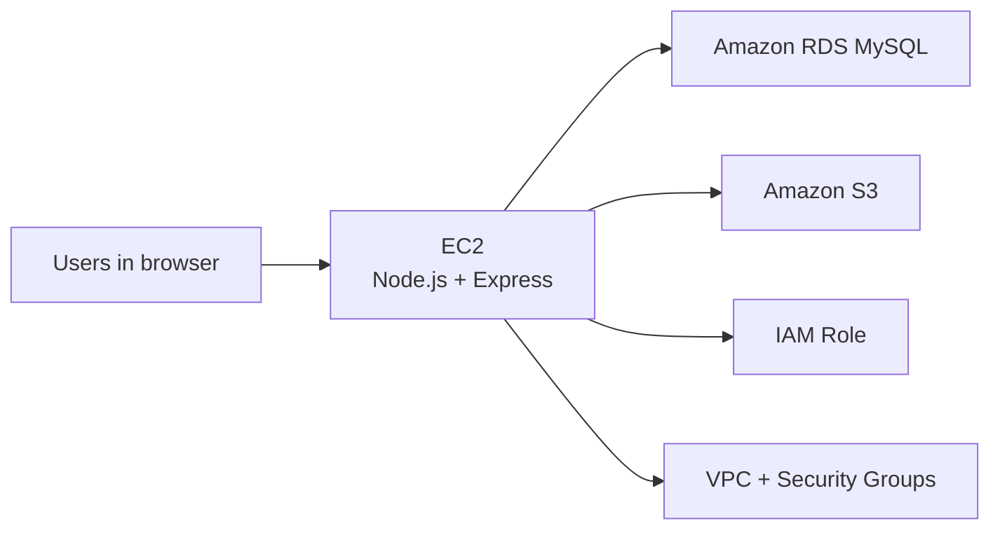
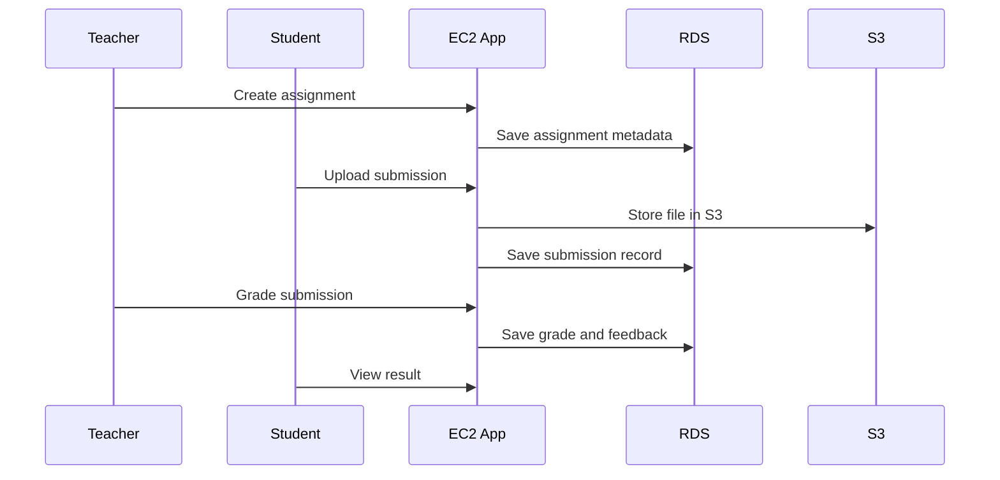

# University Learning Hub

## 15-Minute Presentation Script

This document is written for the teammate responsible for the presentation. It is not only a slide outline. It includes:

- a recommended slide order
- time allocation
- what to say on each slide
- what screenshot or diagram to show
- what points matter most to the lecturer

The overall goal of the presentation should be:

1. show the final system clearly
2. show how AWS services were actually used
3. make the `RDS + S3` integration easy to understand
4. avoid spending too much time on low-value details

The presentation should feel focused. The project now contains many features, so the main risk is trying to present everything equally. The best strategy is to use the platform features to support a simple cloud story:

- `EC2` runs the application
- `RDS` stores structured learning data
- `S3` stores files and attachments
- `VPC + Security Groups + IAM` make the deployment secure and workable

---

## 1. Recommended Slide Plan

For a 15-minute presentation, the following slide structure works well:

1. Title and project summary
2. Problem statement and goals
3. AWS architecture overview
4. Infrastructure setup on AWS
5. System roles and dashboards
6. Core academic features
7. RDS integration
8. S3 integration
9. Assignment workflow
10. Messaging workflow
11. Validation and results
12. Challenges, lessons, and conclusion

This usually results in 12 slides plus optional backup slides.

---

## 2. Presentation Strategy

The presentation should not be a development diary. Do not explain every incremental update. Instead, present the final project as a completed system and then explain:

- what it does
- how it is deployed
- what cloud services it uses
- why those services were necessary

The best speaking flow is:

1. show the system
2. explain the architecture
3. explain the two strongest cloud workflows
4. end with results and lessons learned

The two strongest workflows are:

- `Assignment submission`
- `Course messaging with attachments`

These are the best ones because they clearly demonstrate the difference between:

- data in `RDS`
- files in `S3`

---

## 3. Slide-by-Slide Script

## Slide 1. Title Slide

### Slide title

`University Learning Hub: A Cloud-Based Teaching Platform on AWS`

### What to show

- project title
- team member names
- course name
- one clean screenshot of the login page or home page

### What to say

“Hello everyone. Our project is called University Learning Hub. It is a role-based teaching platform deployed on Amazon Web Services. We designed it as a university learning system with separate views for admins, teachers, and students. The main cloud services we used are VPC, EC2, RDS, and S3.”

### Time

- about 1 minute

### Screenshot suggestion

- Login page with the improved top bar and language selector

---

## Slide 2. Problem and Objectives

### Slide title

`Project Goals`

### What to show

- 4 to 5 bullet points:
  - deploy a web app on AWS
  - support role-based learning workflows
  - use RDS for structured data
  - use S3 for document storage
  - demonstrate secure cloud deployment

### What to say

“Instead of building only a static website, we wanted to build a working educational platform that actually uses AWS services in a meaningful way. Our main goals were to deploy the platform on EC2, use RDS as the main relational database, use S3 for file storage, and support real workflows such as materials, grades, assignments, and communication.”

### Time

- about 1 minute

---

## Slide 3. AWS Architecture Overview

### Slide title

`Cloud Architecture`

### What to show

Use a diagram like this:

### What to say

“This is the high-level architecture of our project. The application runs on an EC2 instance. The EC2 server connects to Amazon RDS for structured application data and to Amazon S3 for cloud file storage. The whole deployment runs inside a custom VPC, and the EC2 instance uses an IAM role to access S3.”

### Time

- about 1.5 minutes

### Important emphasis

Pause briefly on this sentence:

“RDS stores the business data, while S3 stores the files.”

That is the core message the lecturer should remember.

---

## Slide 4. Infrastructure Setup on AWS

### Slide title

`Infrastructure Deployment`

### What to show

- VPC screenshot
- EC2 screenshot
- RDS screenshot
- S3 screenshot

Or, if one slide is too crowded, show:

- a simple table:

| Resource | Purpose |
|---|---|
| VPC | Network isolation |
| EC2 | Application server |
| RDS | Relational database |
| S3 | Cloud document storage |
| IAM role | Secure S3 access |

### What to say

“We created a custom VPC with public and private subnets. The EC2 instance was placed in a public subnet so users could access the application, while the RDS database was placed in private subnets and was not publicly accessible. We also configured separate security groups so the database can only be reached from the application server.”

### Time

- about 1.5 minutes

### Screenshot suggestion

- VPC with subnet view
- EC2 instance summary
- RDS connectivity view

---

## Slide 5. User Roles and Dashboards

### Slide title

`Role-Based Platform Design`

### What to show

- one screenshot each of:
  - admin dashboard
  - teacher dashboard
  - student dashboard

Or combine them into a 3-panel slide.

### What to say

“An important part of our system is the role model. We implemented three user roles. Admin users manage accounts and monitor activity. Teachers manage courses, content, quizzes, assignments, and grading. Students access their courses, download materials, complete quizzes, submit assignments, and communicate with teachers.”

### Time

- about 1 minute

### Speaker note

Do not spend too much time listing every button. Focus on the idea that the platform is role-aware and not a single shared interface.

---

## Slide 6. Core Academic Features

### Slide title

`What the Platform Can Do`

### What to show

- short feature grid:
  - course creation
  - file upload and download
  - announcements
  - quizzes
  - grades
  - assignment submission
  - messaging

### What to say

“The final system supports the main functions of a teaching platform. Teachers can create courses, upload materials, publish announcements, create quizzes, and record grades. Students can access materials, read announcements, complete quizzes, submit assignments, and receive feedback. Admin users can manage the platform and monitor activity.”

### Time

- about 1 minute

### Screenshot suggestion

- Teacher course page showing tabs and modules

---

## Slide 7. Amazon RDS Integration

### Slide title

`How We Used Amazon RDS`

### What to show

- a bullet list or table of data stored in RDS:
  - users
  - sessions
  - courses
  - enrollments
  - announcements
  - quizzes
  - grades
  - assignments
  - messages

You can also show a simplified ER-style diagram.

### What to say

“Amazon RDS is the main structured data layer of our project. We used MySQL on RDS to store users, course metadata, enrollments, announcements, quiz records, grades, assignment metadata, submission records, chat records, and activity logs. We chose RDS because these entities have clear relationships and need reliable querying and filtering.”

### Time

- about 1.5 minutes

### Key sentence

“RDS stores the logic and relationships of the teaching platform.”

---

## Slide 8. Amazon S3 Integration

### Slide title

`How We Used Amazon S3`

### What to show

- S3 bucket screenshot
- or a list:
  - course materials
  - assignment submissions
  - chat attachments

### What to say

“Amazon S3 is used as the file storage layer of our project. Instead of storing large files in the database, we upload them to S3 and keep only the metadata in RDS. In our final platform, S3 stores teaching materials, assignment submissions, and message attachments.”

### Time

- about 1.5 minutes

### Key sentence

“S3 stores the files, and RDS stores the records about those files.”

---

## Slide 9. Assignment Submission Workflow

### Slide title

`Workflow Example 1: Assignment Submission`

### What to show

Use a process diagram or sequence:

### What to say

“This is one of the strongest cloud workflows in our project. The teacher creates an assignment and its metadata is stored in RDS. The student uploads the actual file, which is stored in S3. Then the teacher reviews it and the grade and feedback are saved in RDS. This clearly shows the separation between object storage and relational data.”

### Time

- about 1.5 minutes

### Screenshot suggestion

- Assignment detail page
- Student submission page
- Teacher grading panel

---

## Slide 10. Messaging Workflow

### Slide title

`Workflow Example 2: Public and Private Messaging`

### What to show

- public course chat screenshot
- direct message screenshot
- optional sequence diagram

### What to say

“We also added communication features. Every course has a public discussion area, and teachers and students can also send direct messages. Text messages are stored in RDS, while optional attachments are stored in S3. This is another strong example of meaningful cloud integration.”

### Time

- about 1 minute

### Speaker note

Emphasize that this is not just a static file storage system; it is an interactive cloud application.

---

## Slide 11. Validation and Results

### Slide title

`Testing and Verification`

### What to show

- `/health` response screenshot
- list of successful test cases

Suggested bullets:

- login works for all three roles
- RDS connection verified
- S3 connection verified
- course files upload and download works
- assignment upload and grading works
- public and private chat attachments work

### What to say

“We validated the system both at infrastructure level and at feature level. The health endpoint confirms that the application, database, and S3 bucket are all connected. We also completed real end-to-end tests for course management, file delivery, assignments, and messaging.”

### Time

- about 1 minute

---

## Slide 12. Challenges, Lessons, and Conclusion

### Slide title

`What We Learned`

### What to show

- short bullet list:
  - cloud architecture matters
  - networking and permissions are critical
  - RDS and S3 should be used for different responsibilities
  - deployment troubleshooting is part of real cloud development

### What to say

“One of the most important lessons from this project is that cloud computing is not only about deploying code to a server. It is about designing the right responsibilities for each cloud service. In our project, EC2 runs the platform, RDS manages the structured academic data, and S3 stores the files and attachments. This separation made the platform more realistic and more scalable.”

“In conclusion, our final result is a working cloud-based university learning platform that demonstrates both application design and practical AWS deployment.”

### Time

- about 1 minute

---

## 4. Optional Live Demo Plan

If the presentation includes a short live demo, keep it very short and controlled. The best demo is about 2 minutes and should use only one workflow.

### Recommended demo flow

1. Log in as teacher
2. Open a course
3. Show assignment tab and message tab
4. Switch to student account
5. Show student assignment submission page
6. Show student message page

### Why this is the best demo

It highlights:

- role separation
- course functionality
- RDS-backed metadata
- S3-backed file storage

If time is limited, it is better to show one clean workflow than many partial screens.

---

## 5. Suggested Screenshot Plan for the Presentation

If the presentation is slide-based rather than demo-heavy, these are the most useful screenshots.

### Must-have screenshots

- Login page
- Admin dashboard
- Teacher course page
- Student course page
- Assignment submission page
- Public chat page
- Private message page
- AWS architecture resources
- `/health` response

### Best screenshots for AWS emphasis

- RDS connectivity page
- S3 bucket overview
- Teacher uploads file
- Student downloads file
- Student uploads assignment
- Teacher grades assignment
- Chat message with attachment

---

## 6. Speaker Tips

The presenter should keep these points in mind:

### 6.1 What to emphasize

- Use the word **workflow** often
- Keep repeating the difference between `RDS` and `S3`
- Show that AWS services are integrated into real features

### 6.2 What not to over-explain

- every small UI change
- every intermediate bug fix
- every route in the backend
- every incremental development step

### 6.3 Best repeated message

The best repeated summary for the whole presentation is:

“EC2 runs the platform, RDS stores the structured learning data, and S3 stores the files and attachments.”

If the audience remembers that sentence, the presentation has succeeded.

---

## 7. Possible Questions and Good Answers

### Question

`Why did you use both RDS and S3 instead of only one storage system?`

### Good answer

“Because they solve different problems. RDS is good for structured data with relationships, such as users, courses, grades, and messages. S3 is better for binary objects such as PDFs, uploaded coursework, and attachments.”

---

### Question

`Why was the database placed in private subnets?`

### Good answer

“For security. The database should not be reachable from the public internet. Only the application server should connect to it.”

---

### Question

`Why did you attach an IAM role to EC2?`

### Good answer

“So the application could access S3 securely without storing permanent AWS keys in the code or on the server.”

---

### Question

`What is the strongest cloud feature in your project?`

### Good answer

“The assignment submission workflow and the messaging system, because both clearly combine RDS for metadata and S3 for files.”

---

## 8. Final 30-Second Closing Version

If the presenter needs a strong closing sentence, use this:

“University Learning Hub demonstrates how a realistic teaching platform can be deployed on AWS using EC2, RDS, and S3. The project shows not only infrastructure setup, but also real cloud-based workflows such as document delivery, assignment submission, grading, and course communication.”

---

## 9. Backup Slides

If needed, prepare 2 to 3 backup slides for questions:

### Backup slide A

`Database structure`

Show a simplified database model and explain the main relationships.

### Backup slide B

`S3 object usage`

Show the types of files stored in S3 and the download flow.

### Backup slide C

`Security design`

Show VPC, security groups, private RDS, and IAM role.

These backup slides are useful in case the lecturer asks more technical questions.
