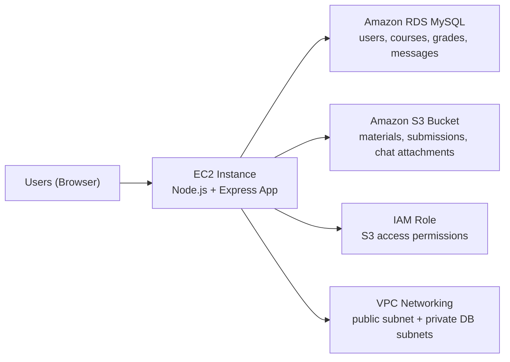

# University Learning Hub

## Report Draft for Cloud Computing Project

This document is written as a report-ready draft for the teammate responsible for the written submission. It is not a chronological development log. Instead, it explains the final system, the cloud architecture, the AWS services used, the implementation decisions, and the main results in a form that can be expanded into a full academic report of roughly 20 to 30 pages once screenshots, diagrams, and citations are added.

Where useful, this document includes screenshot suggestions that can be inserted into the final report.

---

## 1. Executive Summary

The final project is a role-based university teaching platform called **University Learning Hub**. It was designed and deployed as a cloud computing coursework project on **Amazon Web Services (AWS)**. The system is not only a web application running on an EC2 virtual machine; it is a complete cloud-backed learning platform that demonstrates the practical use of **VPC**, **EC2**, **RDS**, **S3**, **IAM**, **security groups**, and AWS-based application deployment.

The platform supports three user roles:

- `Admin`
- `Teacher`
- `Student`

Each role has its own dashboard and permissions. Admin users manage the platform, teachers manage courses and academic content, and students access course materials, submit work, complete quizzes, read announcements, participate in course communication, and review grades.

The strongest cloud-computing aspect of the project is the clear separation between:

- **business data stored in Amazon RDS**
- **documents and attachments stored in Amazon S3**

This separation is visible in multiple parts of the system:

- Course files and downloadable learning materials are stored in `S3`
- Assignment submissions are stored in `S3`
- Chat attachments are stored in `S3`
- Users, courses, announcements, quizzes, grades, assignment metadata, and message records are stored in `RDS`

This makes the project a good example of a cloud-native educational application where infrastructure services are not decorative, but are directly integrated into the application workflow.

### Screenshot suggestion

- Login page with multilingual top bar
- AWS architecture diagram
- `/health` endpoint showing `app`, `database`, and `s3` all working

---

## 2. Project Background and Objectives

The original project idea came from an AWS e-learning deployment guide. The initial concept was a simple student enrolment website hosted on AWS, backed by cloud services such as EC2, RDS, and S3. However, the final system was significantly extended into a more realistic university platform.

The main objectives of the final project were:

1. Deploy a working web application on AWS
2. Use AWS networking and security concepts properly
3. Integrate an EC2-hosted application with an RDS database
4. Use S3 as real cloud document storage
5. Demonstrate role-based functionality for a teaching platform
6. Show that cloud services are used as part of actual workflows, not just mentioned in theory

From a cloud-computing perspective, the most important goal was to demonstrate:

- **compute** on EC2
- **persistent relational storage** on RDS
- **object storage** on S3
- **network isolation** through VPC and private/public subnets
- **access control** through IAM and security groups

The final system therefore goes beyond a simple demo website and behaves like a cloud-backed academic platform prototype.

---

## 3. Final System Overview

The application provides different capabilities depending on the signed-in role.

### 3.1 Admin capabilities

The admin role acts as the system operator and oversight role. Admin users can:

- view platform-wide user directories
- see teacher and student activity
- monitor which users are online or offline
- force-log-out users
- create new users
- bulk-import users by CSV
- export user data by CSV
- create courses
- view recent platform activity logs
- access course-level management

### 3.2 Teacher capabilities

Teachers are the main academic managers of the system. Teachers can:

- create courses
- set course schedule and metadata
- upload course materials
- publish announcements
- create quizzes
- review student activity
- enter and update grades
- create assignments
- review assignment submissions
- grade assignments
- post messages in public course discussion
- send direct messages to students
- export course rosters and grades
- import enrollments and grades via CSV

### 3.3 Student capabilities

Students interact with the platform as course participants. Students can:

- log in to a student dashboard
- access enrolled courses
- download course materials
- read course announcements
- take quizzes
- view posted grades
- open assignments
- upload assignment submissions
- review assignment feedback
- participate in public course chat
- send private messages to teachers

### 3.4 Additional usability features

The final version also includes a number of quality-of-life features that improve the professionalism of the system:

- tab-based dashboards instead of long scrolling pages
- searchable and scrollable tables
- pagination for large datasets
- sorting for students, files, announcements, and quizzes
- automatic refresh for online activity panels
- multilingual UI bar with English, Chinese, German, and French
- operation logs for admin and teacher actions

### Screenshot suggestion

- Admin dashboard showing role-specific panels
- Teacher dashboard showing course management
- Student dashboard showing enrolled courses and grades

---

## 4. AWS Architecture

The deployed system uses the following AWS services:

- `Amazon VPC`
- `Amazon EC2`
- `Amazon RDS`
- `Amazon S3`
- `AWS IAM`
- `Security Groups`

The deployed region is:

- `Europe (Frankfurt) - eu-central-1`

### 4.1 High-level architecture

### 4.2 Networking model

The network design separates public-facing application traffic from database traffic.

- The EC2 instance is placed in a **public subnet**
- The RDS database is placed in **private subnets**
- The database is **not publicly accessible**
- Only the EC2 security group is allowed to connect to the RDS instance on port `3306`

This architecture follows an important cloud security principle: the database should not be directly exposed to the public internet.

### 4.3 VPC setup

The custom VPC was created with:

- VPC CIDR: `10.0.0.0/16`
- 2 public subnets
- 2 private subnets
- no NAT gateway

The public subnet is used for the application server, and the private subnets are used for the database subnet group.

### 4.4 Security groups

Two main security groups were created:

#### `ec2-elearn-sg`

- `SSH 22` from `My IP`
- `HTTP 80` from `0.0.0.0/0`
- `Custom TCP 3000` from `0.0.0.0/0`

#### `rds-elearn-sg`

- `MySQL/Aurora 3306` from `ec2-elearn-sg`

This means:

- users can reach the application server
- only the application server can reach the database

### 4.5 IAM role

The EC2 instance uses an IAM role:

- `ec2-elearn-s3-role`

This role allows the application to interact with S3 without embedding AWS access keys in the code. This is a much cleaner and safer design than storing long-term access credentials on the server.

### Screenshot suggestion

- VPC diagram from AWS console
- EC2 security group inbound rules
- RDS security group inbound rules
- IAM role attached to EC2

---

## 5. Deployed AWS Resources

The final deployed environment includes the following concrete resources.

### 5.1 EC2

- Instance name: `elearning-server`
- Instance type: `t3.micro`
- Operating system: `Amazon Linux 2023`
- Public IP: `3.123.16.253`
- Public DNS: `ec2-3-123-16-253.eu-central-1.compute.amazonaws.com`

This EC2 instance hosts the Node.js application and acts as the application server.

### 5.2 RDS

- DB identifier: `elearning-database`
- Engine: `MySQL`
- DB name: `elearndb`
- Port: `3306`
- Endpoint: `elearning-database.ctuc0ie6sp1v.eu-central-1.rds.amazonaws.com`

This RDS instance stores all core structured application data.

### 5.3 S3

- Bucket: `elearning-platform-files-shuyugui-442426879954-eu-central-1-an`

The S3 bucket is configured with:

- blocked public access
- server-side encryption enabled
- application access through IAM role

### 5.4 Supporting resources

- IAM user: `elearn-admin`
- DB subnet group: `elearn-db-subnet-group`
- VPC: `elearning-platform-vpc-vpc`
- EC2 security group: `ec2-elearn-sg`
- RDS security group: `rds-elearn-sg`

---

## 6. Application Technology Stack

The application is built with a lightweight but practical stack:

- `Node.js`
- `Express.js`
- `MySQL2`
- `Multer` for file upload handling
- `AWS SDK for JavaScript v3`
- `PM2` for process management on EC2

### 6.1 Why this stack was appropriate

This technology choice was suitable for the project for several reasons:

- Node.js and Express allow fast development of a server-rendered web application
- MySQL integrates naturally with Amazon RDS
- Multer is a simple and reliable way to receive uploaded files
- AWS SDK v3 provides direct programmatic access to S3
- PM2 keeps the application alive even when the SSH session ends

The project remains relatively compact while still demonstrating realistic cloud integration.

---

## 7. System Design and Role Model

The application follows a role-based access model where different users receive different permissions and interfaces.

### 7.1 Role design

Three roles are implemented:

- `admin`
- `teacher`
- `student`

Role-aware routing and permissions are enforced in the backend, not only in the frontend. This means a user cannot access restricted actions simply by manually entering URLs.

### 7.2 Session and authentication model

The system uses login sessions stored in the database. After successful login:

- a session token is generated
- the token is stored in the user record
- the token is also stored in a browser cookie

This allows the system to:

- identify the current user
- keep track of activity time
- determine online/offline status
- support force logout from the admin interface

### 7.3 Permission examples

Examples of permission separation include:

- only `admin` can create new users
- only `teacher` and `admin` can create or manage course content
- only `student` can submit assignment files for themselves
- only course managers can grade submissions
- students can only download their own assignment submissions
- private chat attachments can only be accessed by message participants or admin

### Screenshot suggestion

- Admin user directory
- Teacher course management page
- Student assignment detail page

---

## 8. RDS: Relational Database Usage

One of the most important requirements of the project was to demonstrate meaningful use of a managed database service. In this system, Amazon RDS is used as the relational backbone of the platform.

### 8.1 Why RDS was necessary

The application needs structured data with clear relationships:

- users belong to roles
- students belong to courses
- quizzes belong to courses
- grades belong to students and courses
- assignments belong to courses
- submissions belong to assignments and students
- chat messages belong to courses and users

This type of structured, query-heavy data is best handled by a relational database.

### 8.2 Main business data stored in RDS

The final RDS schema stores:

- users
- session tokens
- course metadata
- course memberships
- announcements
- materials metadata
- quizzes
- quiz questions
- quiz attempts
- grades
- assignments
- assignment submissions metadata
- course messages
- operation logs

### 8.3 Examples of RDS-driven workflows

#### User management

The admin panel reads from the user tables to show:

- full name
- email
- role
- password display field for demo use
- online/offline state
- last-seen timestamp

#### Course management

Course creation stores data such as:

- title
- course code
- study level
- program name
- schedule
- description
- creator

#### Quiz and grade workflows

Quiz metadata and question content are stored in RDS, along with:

- each student attempt
- calculated score
- grading timestamps

Grades are stored in RDS because they need:

- structured lookup
- course-by-course querying
- per-student filtering
- export to CSV

#### Assignment workflow

RDS stores:

- assignment title
- description
- due date
- creator
- student submission metadata
- grading values
- teacher feedback

This is important because the **file itself** is not stored in the database. Instead, the database stores the metadata required to manage, query, and present the submission.

#### Chat workflow

RDS stores:

- message text
- sender
- recipient
- course context
- timestamps
- attachment metadata

This allows public course chat and private teacher-student messaging to be queried, filtered, and rendered efficiently.

### 8.4 Why RDS matters for the report

In the final report, it is important to emphasize that RDS is not used only as a passive storage container. It actively supports:

- authentication and sessions
- role-based access control
- course relationships
- teaching workflows
- assessment workflows
- messaging workflows
- activity monitoring

### Screenshot suggestion

- Database schema excerpt or ER-style simplified diagram
- Admin activity table sourced from RDS
- Gradebook table sourced from RDS

---

## 9. S3: Cloud Document Storage Usage

Amazon S3 is the second major cloud service that gives the project its cloud-computing value. S3 is used as the object storage layer for documents and attachments.

### 9.1 Why S3 was necessary

A university platform handles many file-based assets:

- course slides
- lecture notes
- PDFs
- assignment submissions
- chat attachments

These files should not be stored directly inside the relational database. Object storage is the right design choice because it is:

- scalable
- durable
- appropriate for binary files
- easy to integrate with signed URL download patterns

### 9.2 What is stored in S3

The final platform stores the following in S3:

- course material uploads
- student assignment submission files
- public chat attachments
- private chat attachments

### 9.3 How S3 is used in the application

The Node.js application receives uploaded files using Multer, then:

1. generates a structured S3 object key
2. uploads the file to the configured bucket
3. stores the object key and metadata in RDS
4. later generates a signed download URL when the file is requested

This pattern is a strong example of proper cloud application design:

- object storage handles the file
- relational storage handles metadata and permissions

### 9.4 Course materials

Teachers upload courseware to S3. The application stores in RDS:

- title
- original filename
- uploader identity
- timestamp
- S3 object key

Students then download the file through the application.

### 9.5 Assignment submissions

Students upload assignment files to S3. The application stores in RDS:

- assignment ID
- student ID
- file name
- content type
- S3 key
- submission timestamp
- grade
- feedback

This is one of the best demonstrations of **S3 + RDS working together**.

### 9.6 Chat attachments

The chat system supports optional file attachments. When a user sends a message with an attachment:

- the attachment is uploaded to S3
- the message text and attachment metadata are saved in RDS

This shows that S3 is used for more than static course files; it is part of an interactive system workflow.

### 9.7 Security of file access

Files are not exposed as fully public bucket objects. Instead:

- bucket public access remains blocked
- the server uses IAM role access
- the application generates signed download URLs

This allows the system to enforce access control before a file is delivered.

### Screenshot suggestion

- Teacher course materials panel
- Assignment upload page
- Public chat message with attachment
- S3 bucket objects view in AWS console

---

## 10. Core Functional Modules

This section summarizes the final modules implemented in the platform.

### 10.1 User and directory management

Admin users can view a large directory of all platform accounts. The directory supports:

- role-based tabs
- search
- filtering
- pagination
- online/offline display

This module is useful both for administration and for demonstrating the database-backed user model.

### 10.2 Course management

Teachers and admin users can create courses with:

- course title
- code
- study level
- programme
- schedule
- description

Courses are displayed through searchable and filterable cards.

### 10.3 Course materials

Teachers can upload downloadable course files. Students can download them. The files are stored in S3 while metadata remains in RDS.

### 10.4 Announcements

Teachers can post, edit, and delete announcements. Students can read them in course pages and dashboards.

### 10.5 Quizzes

Teachers can create quizzes with multiple questions and options. Students can take quizzes, submit answers, and receive recorded results.

### 10.6 Grades

Teachers can record or update grades. Students can review posted grades in their dashboard and course pages.

### 10.7 Assignment submission system

The assignment system adds a more realistic teaching workflow. Teachers create assignments with title, description, and optional due date. Students upload submission files to S3. Teachers later review and grade the work.

This module is especially valuable because it clearly shows how the platform combines:

- relational data in RDS
- file storage in S3

### 10.8 Public and private messaging

Each course now includes:

- a public course discussion board
- private teacher-student messaging

This extends the platform from a static teaching site into a more interactive learning environment.

### 10.9 Operation logs

Admin and teacher actions are logged in the database. Logged actions include:

- course creation
- announcement posting
- grading
- assignment creation
- chat actions
- roster changes

This makes the platform more auditable and easier to explain as a managed system.

---

## 11. Cloud-Relevant Workflows

For the final report, it is useful to explain the system through workflows rather than only through feature lists.

### 11.1 Workflow A: Course material upload

1. Teacher opens a course
2. Teacher uploads a material file
3. Server receives the file
4. Server uploads file to S3
5. Server writes file metadata to RDS
6. Student opens course
7. Student downloads file through signed access

### 11.2 Workflow B: Assignment submission

1. Teacher creates assignment
2. Assignment metadata is stored in RDS
3. Student opens assignment page
4. Student uploads file
5. File is stored in S3
6. Submission metadata is stored in RDS
7. Teacher opens assignment review page
8. Teacher grades submission
9. Grade and feedback are stored in RDS
10. Student views final result

### 11.3 Workflow C: Public course chat with attachment

1. Teacher posts a course message
2. Optional attachment is uploaded to S3
3. Message record is stored in RDS
4. Student opens messages tab
5. Student reads the message and downloads the attachment

### 11.4 Workflow D: Private direct message

1. Teacher selects a student recipient
2. Teacher sends direct message and optional attachment
3. Attachment is stored in S3
4. Message record is stored in RDS
5. Student opens direct conversation
6. Student reads the message and accesses the attachment

These workflows should be highlighted in the final report because they clearly show where each AWS service is used.

### Screenshot suggestion

- One screenshot for each of the four workflows above

---

## 12. Deployment Process

The deployment followed a standard cloud deployment flow and can be described as a sequence of infrastructure and application steps.

### 12.1 Create AWS account and IAM access

An IAM user was created to avoid using the AWS root account for normal project work. This is consistent with basic cloud security practice.

### 12.2 Create VPC and security boundaries

A custom VPC was created with public and private subnets. Security groups were configured so that:

- the app server is reachable
- the database is isolated

### 12.3 Launch EC2 instance

An Amazon Linux 2023 instance was launched and used as the application host.

### 12.4 Create S3 bucket

An S3 bucket was created for course files, submissions, and attachments. Public access was blocked and encryption was enabled.

### 12.5 Create IAM role for EC2

An IAM role was attached to the EC2 instance so the application could upload and download S3 objects securely.

### 12.6 Create RDS instance

A MySQL RDS database was deployed in private subnets using the dedicated security group.

### 12.7 Install the application on EC2

The application code was copied to the EC2 instance. Node.js packages were installed, environment variables were configured, and the schema was loaded into RDS.

### 12.8 Process management

`PM2` was used to keep the application online. This prevents the server from stopping when an SSH session ends.

### Screenshot suggestion

- EC2 instance summary
- RDS connectivity page
- S3 bucket overview
- PM2 status on the server

---

## 13. Validation and Testing

The project was tested both at feature level and at system level.

### 13.1 Infrastructure validation

The `/health` endpoint verifies:

- application health
- database connectivity
- S3 connectivity

This is useful both for demonstration and for deployment troubleshooting.

### 13.2 Functional validation

The following functional tests were completed successfully:

- login for admin, teacher, and student
- course creation
- announcement creation and viewing
- material upload and student download
- quiz creation and student submission
- grade recording and student review
- assignment creation
- assignment submission upload
- assignment grading
- public course message posting
- private direct messaging
- CSV import/export
- online status refresh

### 13.3 Example validated scenario

A complete real test scenario was executed:

1. Teacher created an assignment
2. Student uploaded a submission
3. Teacher graded it
4. Student viewed grade and feedback
5. Teacher posted a public message with attachment
6. Teacher sent a direct message with attachment
7. Student viewed both messages and downloaded the attachments

This scenario is especially valuable for the report because it proves the cloud workflows are not only theoretical.

---

## 14. Security and Access Control Considerations

Although this is a coursework project and not a production enterprise platform, several useful security practices were implemented.

### 14.1 Good security practices used

- database is not publicly accessible
- S3 bucket public access is blocked
- EC2 accesses S3 via IAM role rather than stored access key
- security groups restrict RDS access to the app server
- user actions are role-restricted in backend routes
- signed URLs are used for file delivery

### 14.2 Demo-oriented compromises

One part of the admin interface displays usernames and passwords for demo convenience. This helps with classroom demonstration and account testing, but it would not be acceptable in a production system.

This point should be acknowledged explicitly in the final report. It is better to mention it proactively than to leave it unaddressed.

### 14.3 Future production improvements

If this system were extended beyond coursework, the following improvements would be recommended:

- hashed-password-only admin view
- password reset flow instead of password display
- MFA for admin users
- finer-grained IAM permissions
- HTTPS via load balancer and certificate
- CloudWatch alarms
- structured application logging

---

## 15. UI and User Experience Considerations

The final system also includes front-end usability improvements that make the application more presentable and easier to use during live demonstration.

These include:

- menu-bar navigation on long pages
- searchable and scrollable data blocks
- pagination on large tables and content feeds
- collapsible content sections
- multilingual top bar
- improved visual styling and animations

These choices matter for the report because they show that the system was not only deployed, but also made usable for different categories of users.

---

## 16. Limitations

No project is complete without limitations, and including them in the report makes the work stronger and more honest.

Important current limitations include:

- chat is not real-time WebSocket chat; it is page-based and request-driven
- multilingual support is implemented client-side rather than through full backend localisation
- the platform does not yet include advanced analytics or recommendation features
- admin password display is a demo convenience, not a production-safe feature
- the project is optimized for coursework and demonstration rather than large-scale production traffic

These limitations do not reduce the value of the project as a cloud computing coursework submission. In fact, they help frame the project correctly as a realistic academic prototype.

---

## 17. Possible Future Work

If the report includes a “future improvements” section, the following items are strong candidates:

- assignment deadline enforcement with penalties or late labels
- live notification system
- WebSocket-based real-time chat
- S3 object versioning for course materials
- CloudWatch monitoring dashboards
- RDS automated backup and recovery discussion
- load balancer and HTTPS
- containerized deployment
- audit-log export and analytics

These ideas are useful because they connect naturally to cloud computing topics.

---

## 18. Conclusion

This project successfully demonstrates how a multi-role educational platform can be built and deployed on AWS using a practical combination of cloud services.

The final system is significant for three reasons.

First, it demonstrates **infrastructure deployment** on AWS:

- custom VPC
- EC2 instance
- RDS database
- S3 bucket
- IAM role
- security groups

Second, it demonstrates **application-level cloud integration**:

- course documents in S3
- assignment submissions in S3
- chat attachments in S3
- user, course, message, and academic data in RDS

Third, it demonstrates **real teaching workflows**:

- role-based access
- course management
- announcements
- quizzes
- grading
- assignments
- messaging

The most important conclusion for the final report is that this project is not just a web interface deployed on AWS. It is a real cloud-backed learning platform where each core AWS service has a visible and meaningful purpose.

---

## 19. Suggested Report Structure

The teammate writing the report can use the following final structure:

1. Title page
2. Abstract
3. Introduction
4. Project objectives
5. AWS architecture overview
6. Infrastructure setup
7. Application design
8. Role-based system design
9. RDS usage and schema design
10. S3 usage and file workflows
11. Core functional modules
12. Deployment process
13. Validation and testing
14. Security considerations
15. Limitations
16. Future work
17. Conclusion
18. Appendix: screenshots, URLs, resource names

If screenshots and diagrams are added carefully, this structure is more than enough for a 20 to 30 page report.

---

## 20. Suggested Screenshots Checklist

The following screenshots would be especially useful:

### Infrastructure screenshots

- AWS VPC overview
- EC2 instance summary
- RDS connectivity and subnet group
- S3 bucket overview
- IAM role attached to EC2
- Security group rules

### Application screenshots

- Login page
- Admin dashboard
- Teacher dashboard
- Student dashboard
- Course detail page
- Materials section
- Announcements section
- Quiz section
- Assignment detail page
- Public course chat
- Private direct message page
- Gradebook
- `/health` endpoint

### Best screenshots for the S3 + RDS story

- teacher uploads material
- student downloads material
- student uploads assignment file
- teacher grades assignment
- public message with attachment
- direct message with attachment

These are the screenshots that best support the cloud computing learning outcomes.
